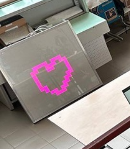
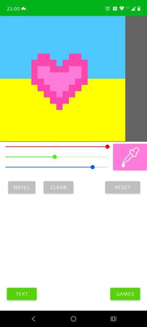
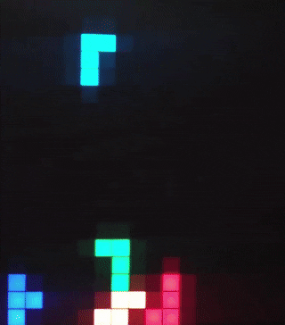

# RGB LED Matrix 20×20 🎨📱
**ESP8266-powered LED matrix controlled by an Android app. Draw, scroll, or play games like Tetris & Snake.**

## 🎬 Demo

  
*20×20 RGB LED matrix in action*

  
*Android app interface: draw, write text, or play*

*Watch Tetris on the matrix.*

---

## 🧠 Project Overview

This project features a 20×20 RGB LED matrix driven by an ESP8266 microcontroller.  
It creates its own **Wi-Fi Access Point**, receives **UDP commands** from an Android app, and displays:

- 🖌️ Custom drawings (pixel editor)
- 🪶 Scrolling text (marquee)
- 🐍 Snake game
- 🧱 Tetris game

The Android app is written in Java using **Android Studio** and connects directly to the ESP8266.

### 🔧 Tech Stack

- **Microcontroller**: ESP8266 (Arduino core)
- **Communication**: Wi-Fi AP mode + UDP protocol
- **Mobile app**: Java (Android Studio)
- **LED Control**: FastLED or Adafruit_NeoPixel (уточниш)

---

## 🇺🇦 Опис українською

Це 20×20 RGB світлодіодна матриця, яка керується зі смартфона через Wi-Fi.  
ESP8266 створює точку доступу, приймає UDP-команди та відображає:

- 🎨 Малюнки (піксельна сітка)
- 📝 Бігучий рядок
- 🐍 Гру Змійка
- ⬛ Гру Тетріс

Програма для смартфона написана на Java в Android Studio.  
Цей проєкт використовувався як демонстраційний на виставках.

---

## 💡 What I learned

- Розробка Android-додатків на Java (перше знайомство з Android Studio)
- Робота з UDP на ESP8266 (налаштування сокетів, парсинг, апаратні обмеження)
- Реалізація простих ігор під обмежену площу матриці
- Взаємодія між embedded-пристроями та мобільними додатками

---

## 📦 How to use

1. Flash the ESP8266 with the provided Arduino sketch
2. Install the Android APK (or build in Android Studio)
3. Connect to the ESP Wi-Fi network
4. Launch the app and control the matrix in real time

---

## 👤 Author

Project by [Ruslan](https://github.com/Tataty)